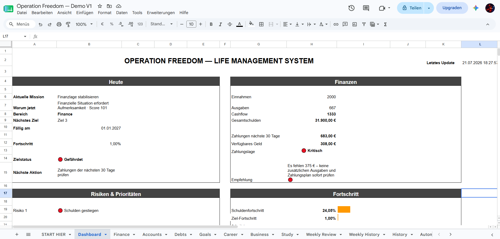
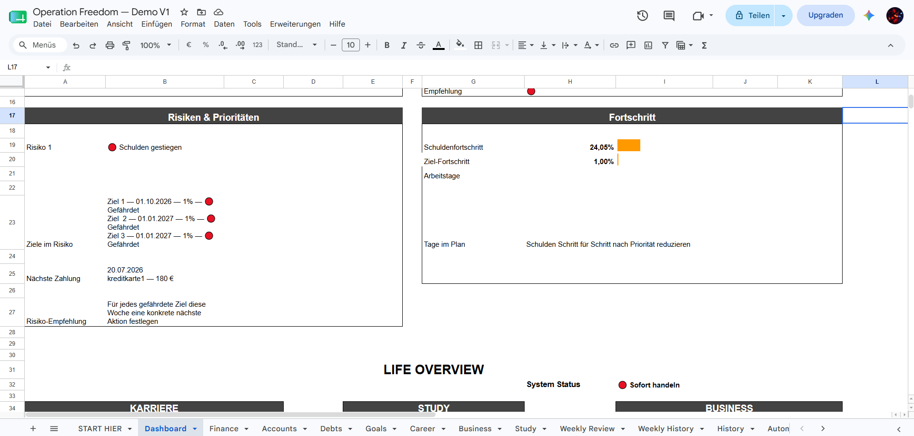
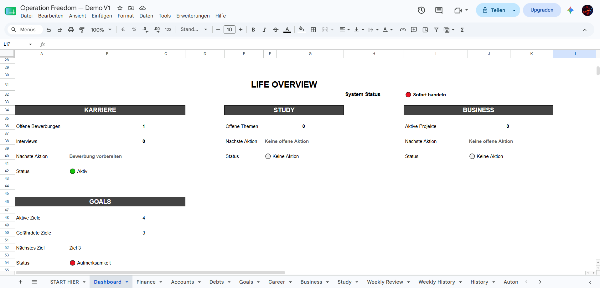
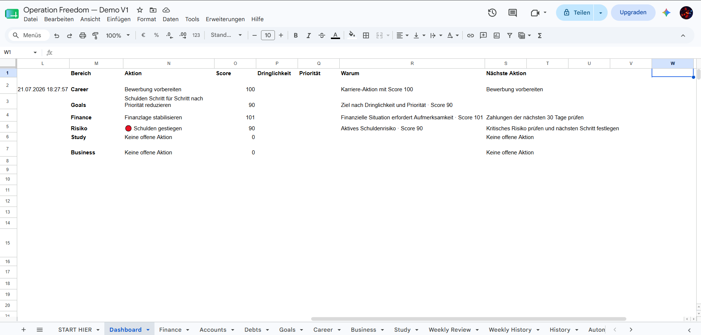

# Operation Freedom – Life Management System

Operation Freedom ist ein datenbasiertes Life-Management-System, das wichtige Lebensbereiche in einem zentralen System miteinander verbindet.

Das Projekt entstand aus der Idee, verstreute Informationen nicht nur zu dokumentieren, sondern daraus einen besseren Überblick, klare Prioritäten und konkrete nächste Schritte abzuleiten.

## Das Problem

Finanzen, Schulden, persönliche Ziele, Karriere, Weiterbildung und eigene Projekte werden häufig getrennt voneinander verwaltet.

Dadurch fehlt ein Gesamtüberblick:

- Wo stehe ich aktuell?
- Welche Bereiche benötigen Aufmerksamkeit?
- Was sollte ich als Nächstes tun?
- Welche Aufgabe hat aktuell die höchste Priorität?
- Verbessert sich die Gesamtsituation tatsächlich über die Zeit?

Operation Freedom versucht, diese Informationen in einem gemeinsamen System zusammenzuführen und daraus handlungsorientierte Informationen abzuleiten.

## Aktuelle Funktionen

- Verwaltung von Einnahmen und Ausgaben
- Übersicht und Fortschrittskontrolle von Schulden
- Zielmanagement
- Bewerbungs- und Karriere-Tracking
- Verwaltung von Lern- und Weiterbildungsthemen
- Business- und Projektmanagement
- Zentrales Management-Dashboard
- Regelbasierter Decision Engine zur Priorisierung
- Risiko- und Statusbewertung
- Automatisierte tägliche und wöchentliche Snapshots
- Historische Entwicklung wichtiger Kennzahlen
- Weekly Review zur regelmäßigen Kontrolle und Planung
- Automation Logging zur Überwachung automatisierter Prozesse

## Einblicke in das System

### Zentrales Dashboard

Das Dashboard fasst die wichtigsten Informationen zusammen und zeigt die aktuelle Mission, finanzielle Situation, Risiken, Fortschritt und die nächste empfohlene Aktion.

### Risiken und Fortschritt

Risiken, gefährdete Ziele und wichtige Fortschrittskennzahlen werden zentral dargestellt.

### Life Overview

Die Life Overview verbindet verschiedene Lebensbereiche und zeigt deren aktuellen Status sowie offene Aktionen.

### Decision Engine

Der regelbasierte Decision Engine bewertet verschiedene Bereiche anhand definierter Kriterien und Scores. Daraus werden die aktuelle Priorität, deren Begründung und die nächste Aktion abgeleitet.

## Verwendete Technologien und Methoden

- Google Sheets
- Google Apps Script
- Datenmodellierung
- KPI-Design
- Business Logic
- Prozessautomatisierung
- Regelbasierte Entscheidungslogik
- Dashboard-Konzeption

## Meine Rolle im Projekt

Ich habe das System von der Problemdefinition über die Strukturierung der Daten bis zum funktionsfähigen Prototype entwickelt.

Dabei lag mein Fokus insbesondere auf:

- Analyse und Strukturierung eines realen Problems
- Entwicklung eines geeigneten Datenmodells
- Definition relevanter KPIs
- Verknüpfung verschiedener Datenbereiche
- Entwicklung von Regeln zur Priorisierung und Risikobewertung
- Automatisierung wiederkehrender Prozesse
- Darstellung entscheidungsrelevanter Informationen in einem Dashboard

## Projektstatus

**Version 1.0 – Funktionsfähiger Prototype**

Die aktuelle Version wird im realen Einsatz getestet.

Auf Basis der Nutzung und zukünftigen Feedbacks soll geprüft werden, welche Funktionen tatsächlich einen Mehrwert bieten und wie das System weiterentwickelt werden kann.

Eine mögliche zukünftige Entwicklungsrichtung ist die Umsetzung als eigenständige Web-Anwendung.

## Entwicklungsprinzip

**Ship → Test → Learn → Improve**

Der Fokus liegt darauf, eine funktionierende Lösung früh einzusetzen, Erfahrungen aus der realen Nutzung zu sammeln und das System anschließend gezielt weiterzuentwickeln.
